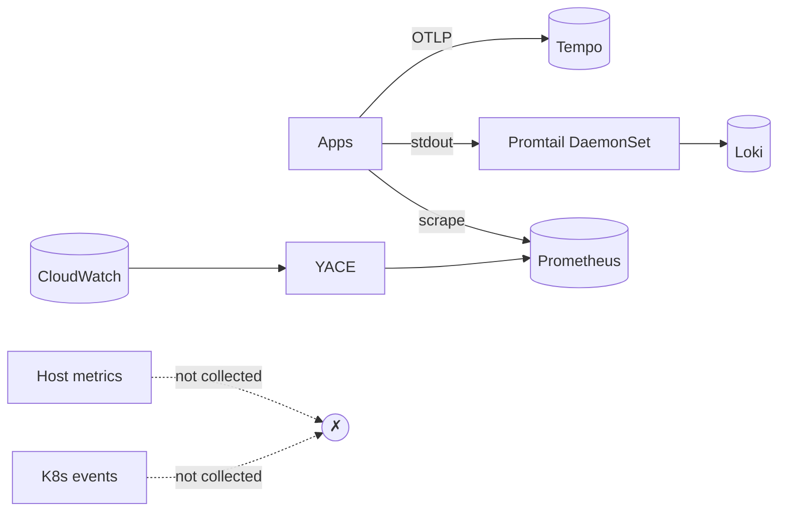

# Architecture — unified ingestion via OTel Collector

## Before — fragmented topology



Each signal owns its own collection mechanism. Pod metadata, redaction, and
tail-sampling have to be configured per-tool (or are missing entirely).

## After — collector as the ingestion backbone

```mermaid
flowchart LR
  subgraph node[Each node]
    agent[OTel Agent\nDaemonSet]
  end
  subgraph cluster[Cluster-wide]
    gateway[OTel Gateway\nDeployment]
  end

  apps[Apps] -->|OTLP| agent
  podlogs[/var/log/pods/**] -->|filelog| agent
  hostm[Host /proc, /sys] -->|hostmetrics| agent
  kubelet[Kubelet /stats] -->|kubeletstats| agent

  agent -->|OTLP gRPC| gateway

  k8sapi[K8s API] -->|k8s_events| gateway
  k8sapi -->|k8s_cluster| gateway

  gateway -->|OTLP| tempo[(Tempo)]
  gateway -->|OTLP HTTP| loki[(Loki)]
  gateway -->|remote_write| prom[(Prometheus)]
```

### What each tier owns

| Tier | Receivers | Why it lives here |
|------|-----------|-------------------|
| **Agent** (DaemonSet) | `otlp`, `filelog`, `hostmetrics`, `kubeletstats` | Anything that needs node-local filesystem or kubelet access |
| **Gateway** (Deployment) | `otlp`, `k8s_events`, `k8s_cluster` | Anything cluster-wide; central place for tail sampling, redaction, batching, fan-out |

Every pipeline runs the `k8sattributes` processor, so traces, logs, and
metrics all carry the same `service.name`, `k8s.pod.name`,
`k8s.namespace.name`, `k8s.node.name` — which is what makes Grafana
trace ↔ log ↔ metric jumps actually land on the right row.

## Rollback per step

Each step folder is one Helm upgrade you can roll back independently:

```bash
# Roll a single step back to the previous values
helm rollback otel-gateway -n observability
helm rollback otel-agent   -n observability

# Or revert to a specific step's values explicitly
helm upgrade otel-gateway open-telemetry/opentelemetry-collector \
  -n observability -f 03-otel-collector/gateway-values.yaml
```

## YACE decision (out-of-scope for this lab)

Two paths if you later need AWS CloudWatch metrics:

1. **Keep YACE.** Simpler config; YACE writes to Prometheus, the collector
   reads from there or ignores it entirely. No collector changes.
2. **Use `awscloudwatchreceiver`.** Unified config under the same collector
   pipeline (consistent k8sattributes, redaction, etc.) but configuration
   is significantly heavier per-metric. Recommended once you have >1 AWS
   account to deal with or when CloudWatch metrics need to participate in
   the same redaction/tail-sampling rules as the rest.

This lab does not deploy either, since AWS isn't in scope.
