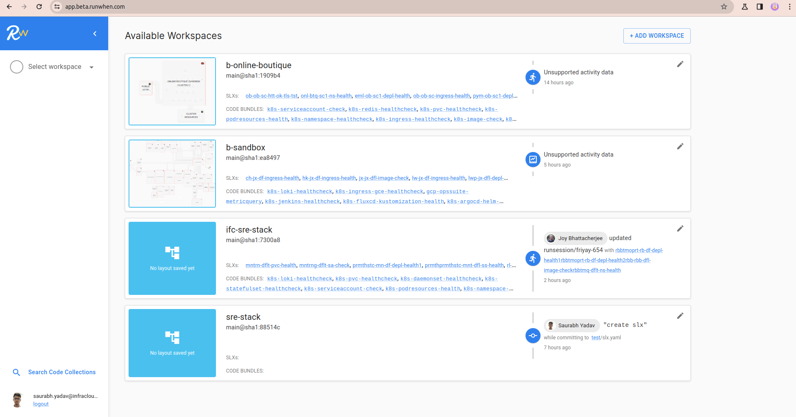
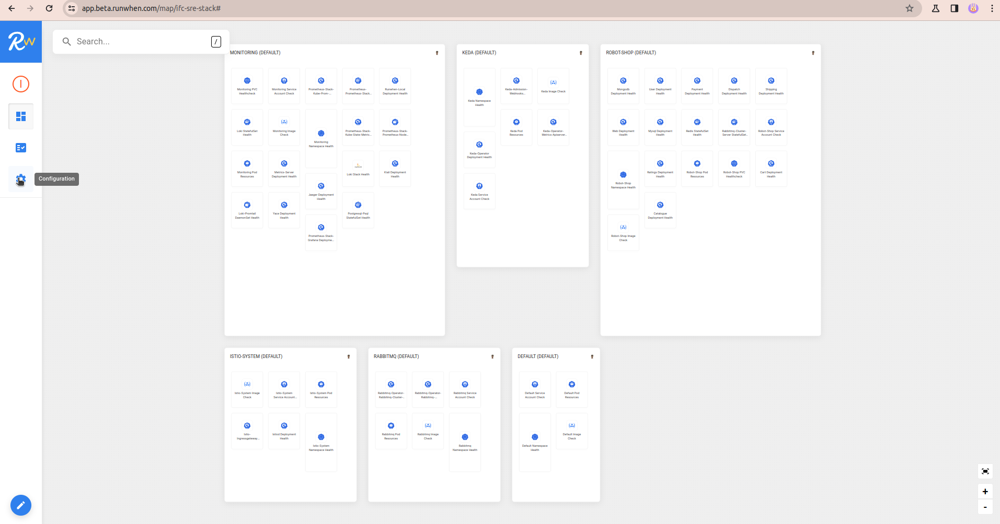
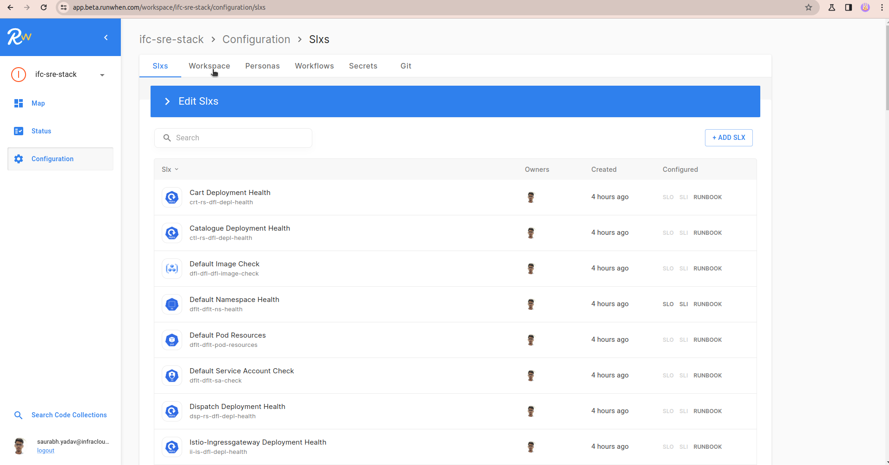

### Install RunWhen local

To connect RunWhen local to the RunWhen platform, you need to set a few parameters in the `.env` file. These parameters are obtained from the `uploadInfo.yaml`, which is downloaded from the RunWhen platform as shown below:

Select your workspace, let say it's `ifc-sre-stack`



Click on configuration button on left side:



Click on Workspcae:



At bottom click on `Automated Workspace Builder Config File`


```
# RunWhen:
RUNWHEN_TOKEN=update_token_here
RUNWHEN_WORKSPACE_NAME=ifc-sre-stack
RUNWHEN_DEFAULTLOCATION=location-01-us-west1
RUNWHEN_PAPIURL=https://papi.beta.runwhen.com
RUNWHEN_WORKSPACE_OWNER_EMAIL=saurabh.yadav@infracloud.io
```

RunWhen is installed with whole setup:

```bash
make setup
```

